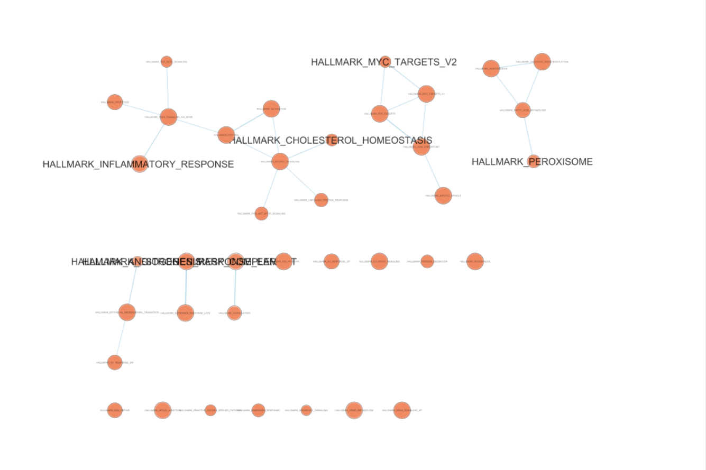
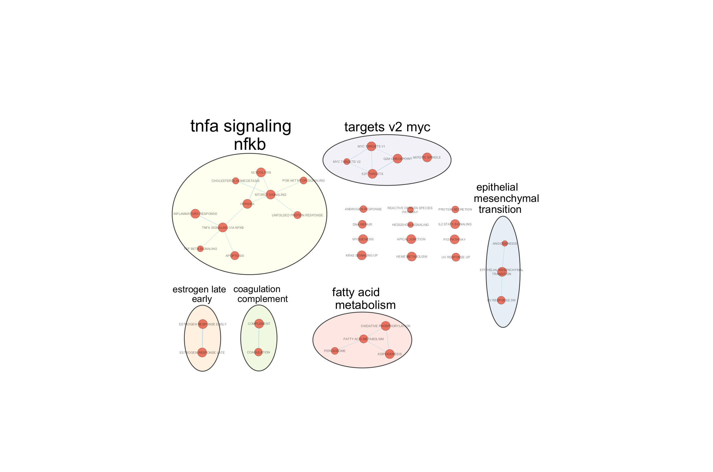
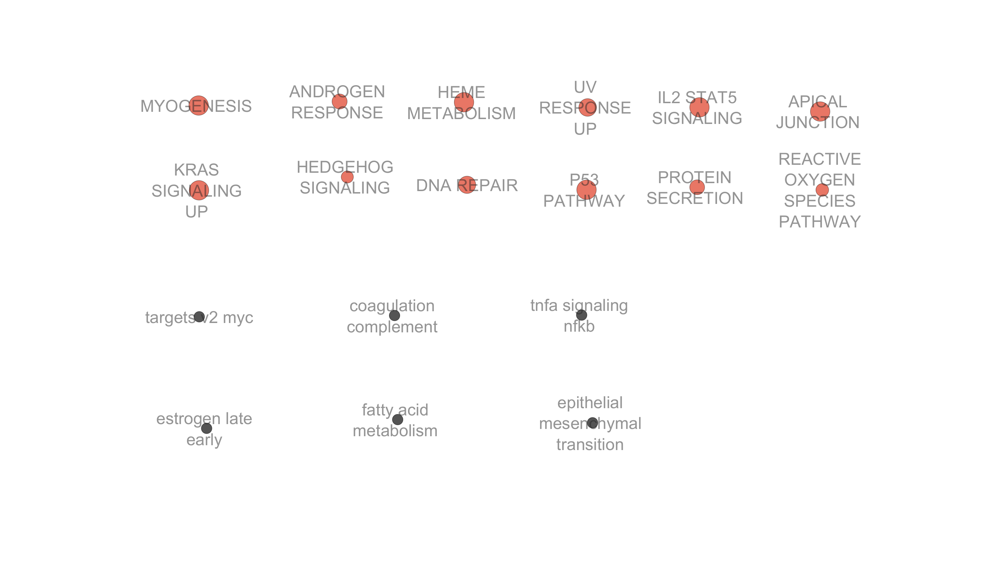

```{r setup, message=FALSE, warning=FALSE}
if (!requireNamespace("BiocManager", quietly = TRUE))
    install.packages("BiocManager")

# A1
packages <- c("GEOquery", "edgeR", "limma", "knitr",
              "ggplot2", "pheatmap", "org.Hs.eg.db", "dplyr")

# A2 to be used
a2_packages <- c("clusterProfiler", "enrichplot", "fgsea", "msigdbr", "ggrepel")

all_packages <- c(packages, a2_packages)
for (pkg in all_packages) {
  if (!require(pkg, character.only = TRUE, quietly = TRUE)) {
    BiocManager::install(pkg, update = FALSE, ask = FALSE)
    library(pkg, character.only = TRUE)
  }
}
knitr::opts_chunk$set(
  echo = TRUE,
  warning = FALSE,
  message = FALSE,
  fig.width = 10,
  fig.height = 8,
  fig.path = "figures/"
)
```

---

# Introduction

## Dataset Overview

For this assignment, I will perform pathway enrichment analysis using previously generated differential expression analysis. This type of analysis will investigate the processes and pathways associated with neoadjuvant chemotherapy (NAC) resistance in breast cancer, which is the dataset used.

The dataset used is GSE309004, which can be accessed at: [https://www.ncbi.nlm.nih.gov/geo/query/acc.cgi?acc=GSE309004](https://www.ncbi.nlm.nih.gov/geo/query/acc.cgi?acc=GSE309004). The original study (Guevara-Nieto et al., 2025) that this data is from is a paired study, where the same patient would contribute a biopsy at two different times (before and after NAC). All 35 of the patients in this dataset are "non-responders", meaning they showed no response to chemotherapy.

The original study  focused on the transcriptome changes between samples to try to learn about treatment resistance. They report an array of findings, including genes FOS and NR4A1 being consistently differentially expressed, IL-17, MAPK, NF-κB, and TNF signaling pathways being enriched, and post-NAC infiltration of CD4 memory T cells, regulatory T cells, neutrophils, and macrophages being increased. Throughout this report, I will compare my findings to what the original authors found, both on a statistical level and a biological background level.

## Reproducing the A1 Pipeline

Here, I re-create the full pipeline from assignment 1 that was used to do data processing and differential expression. I chose to do this rather than loading a saved file for the sake of reproducability. This means the notebook is self-contained and can be run start to finish. Note: the statistical tests and visualization done to justify which outliers were removed and which normalization method was chosen are *not* included. The purpose of this part is mostly so this report can be ran on the raw data.

### Data Loading

First, the GEO data is downloaded using `getGEO()`. To make sure that we only keep gene symbols that are valid HUGO symbols, they are compared to `org.Hs.eg.db`. The three statistical outliers identified in A1 (X014Q.Tn, X083Q.Tn, X226B.Tn) are then removed.

```{r recreate_a1_processing, message=FALSE, warning=FALSE}
geo_id <- "GSE309004"
if (!file.exists(paste0(geo_id, "_metadata.Rdata"))) {
  gse <- getGEO(geo_id, GSEMatrix = TRUE, getGPL = FALSE)
  save(gse, file = paste0(geo_id, "_metadata.Rdata"))
} else {
  load(paste0(geo_id, "_metadata.Rdata"))
}
sample_info <- pData(gse[[1]])
files <- list.files(geo_id, full.names = TRUE)
count_file <- files[1]
expression_data <- read.table(count_file,
                              header = TRUE,
                              row.names = 1,
                              sep = "\t")
valid_symbols <- keys(org.Hs.eg.db, keytype = "SYMBOL")
mapped_genes <- rownames(expression_data) %in% valid_symbols
expression_clean <- expression_data[mapped_genes, ]
clean_colnames <- gsub("^X", "", colnames(expression_clean))
clean_colnames <- gsub("\\.", "-", clean_colnames)
match_idx <- match(clean_colnames, sample_info$title)
sample_info <- sample_info[match_idx, ]
sample_info$condition <- ifelse(grepl("B", sample_info$title) &
                                !grepl("Q", sample_info$title),
                                "Baseline", "FollowUp")
outliers <- c("X014Q.Tn", "X083Q.Tn", "X226B.Tn")
expression_clean <- expression_clean[, !(colnames(expression_clean) %in% outliers)]
outlier_titles <- gsub("^X", "", gsub("\\.", "-", outliers))
sample_info <- sample_info[!(sample_info$title %in% outlier_titles), ]
```

### Normalization and Differential Expression

Since edgeR's TMM normalization needs raw counts, those are loaded. Then, `intersect()` is used to restrict this to only genes that appear in both the cleaned expression matrix and the raw counts file. TMM normalization is then applied. 

For differential expression, "Baseline" condition is set as the reference level (this is pre-treatment). Differential expression is extracted with the pipeline (`estimateDisp()` → `glmQLFit()` → `glmQLFTest()`). Finally, the results are saved for all genes to prepare for using GSEA (which wants the FULL ranked list).

```{r recreate_de_analysis, message=FALSE, warning=FALSE}
raw_file <- list.files(geo_id, pattern = "rawcounts", full.names = TRUE)
raw_counts <- read.table(gzfile(raw_file),
                         header = TRUE,
                         row.names = 1,
                         sep = "\t")
common_genes <- intersect(rownames(expression_clean), rownames(raw_counts))
raw_counts <- raw_counts[common_genes, colnames(expression_clean)]
dge <- DGEList(counts = raw_counts)
dge <- calcNormFactors(dge, method = "TMM")
final_expression_data <- cpm(dge, log = TRUE, prior.count = 1)
group <- factor(sample_info$condition, levels = c("Baseline", "FollowUp"))
design <- model.matrix(~group)
colnames(design) <- c("Intercept", "FollowUp_vs_Baseline")
dge_de <- DGEList(counts = raw_counts)
dge_de <- calcNormFactors(dge_de, method = "TMM")
dge_de <- estimateDisp(dge_de, design)
fit <- glmQLFit(dge_de, design)
qlf <- glmQLFTest(fit, coef = 2)
results_table <- as.data.frame(topTags(qlf, n = Inf))
fdr_threshold <- 0.05
logfc_threshold <- 1
sig_genes <- results_table[results_table$FDR < fdr_threshold &
                           abs(results_table$logFC) > logfc_threshold, ]
```

### A1 Summary Statistics

Here, I generate a table to summarize some important statistics from the reproduction of A1. These numbers confirm that the reproduced pipeline matches the original results, and provide some more context about the data. 

```{r a1_statistics}
n_baseline <- sum(sample_info$condition == "Baseline")
n_followup <- sum(sample_info$condition == "FollowUp")
n_up <- sum(results_table$FDR < fdr_threshold & results_table$logFC > logfc_threshold)
n_down <- sum(results_table$FDR < fdr_threshold & results_table$logFC < -logfc_threshold)

stats_df <- data.frame(
  Category = c(
    "Original samples", "Samples after QC", "Baseline samples", "FollowUp samples",
    "Outliers removed", "Original genes", "Mapped to HUGO (97.28%)", "Unmapped genes",
    "Total genes tested", "DE genes (FDR<0.05, |logFC|>1)", "Upregulated", "Downregulated"
  ),
  Value = c(54, 51, n_baseline, n_followup, 3, 20287, 19736, 551,
            nrow(results_table), nrow(sig_genes), n_up, n_down)
)

knitr::kable(stats_df,
             caption = "**Table 1.** Summary statistics from the reproduced Assignment 1 pipeline.",
             col.names = c("Metric", "Count"))
```

---

# Preparing Gene Lists for Enrichment Analysis

To prepare for ORA, we first split differential expression results into upregulated only, downregulated only, and all DE genes combined. These will each be analyzed individually, then compared. Additionally, we maintain a continuous ranked list that is needed for GSEA. 

I use the same filtering for upregulated/downregulated genes as was used in A1 (FDR < 0.05, |logFC| > 1). After doing this, the combined list is generated as the union of the up/down lists. Additionally, I use for the "universe"/ background set all of the tested genes. This is important, because not all human genes were tested, so using all human genes as the background would potentially falsely increase significance of enrichment. 

The metric that I used for the GSEA ranked list is -log10(p-value)*sign(logFC). This captures the statistical significance in p-value with the biological information in the sign of the logFC. The result is that low p-value and positive fold change genes are at the top of the list (most upregulated), with high p-value genes in the middle, then low p-value negative fold change genes at the end.

```{r prepare_gene_lists}
up_genes      <- rownames(results_table)[results_table$FDR < fdr_threshold &
                                          results_table$logFC > logfc_threshold]
down_genes    <- rownames(results_table)[results_table$FDR < fdr_threshold &
                                          results_table$logFC < -logfc_threshold]
all_de_genes  <- c(up_genes, down_genes)
background_genes <- rownames(results_table)
results_table$rank_metric <- -log10(results_table$PValue) * sign(results_table$logFC)
ranked_genes <- sort(setNames(results_table$rank_metric, rownames(results_table)),
                     decreasing = TRUE)
```

---

# Thresholded Over-Representation Analysis

## Method Choice

I chose to perform ORA using `clusterProfiler` (Yu et al., 2012). clusterProfiler is a Bioconductor package for ORA that uses Benjamini-Hochberg FDR correction. Some reasons I chose to user it include that it is fully self-contained in R and it has extensive documentation so that I can fully understand its mechanisms. 

For the annotation database, I chose Gene Ontology Biological Process (GO:BP), which is sourced from `org.Hs.eg.db`. To my knowledge, GO:BP provides the broadest and most granular coverage of biological processes, which is why I chose it.

For all ORA runs, I used the following thresholds:
- Adjusted p-value: < 0.05
- Minimum gene set size: 10
- Maximum gene set size: 500
- Background universe: all 19,735 tested genes (again, NOT all human genes)

## Converting Gene Symbols to Entrez IDs

`enrichGO()` from clusterProfiler is going to convert to entrez IDs anyways. This worried me, because I did not want to lose any data or miss errors without knowing. Because of this, I chose to manually convert to entrez IDs before running clusterProfiler. As shown below, all genes were successfully converted. 

```{r convert_entrez}
symbol_to_entrez <- function(gene_symbols) {
  mapping <- AnnotationDbi::select(org.Hs.eg.db,
                                   keys = gene_symbols,
                                   columns = "ENTREZID",
                                   keytype = "SYMBOL")
  mapping <- mapping[!is.na(mapping$ENTREZID), ]
  mapping <- mapping[!duplicated(mapping$SYMBOL), ]
  return(setNames(mapping$ENTREZID, mapping$SYMBOL))
}

up_entrez    <- symbol_to_entrez(up_genes)
down_entrez  <- symbol_to_entrez(down_genes)
all_entrez   <- symbol_to_entrez(all_de_genes)
bg_entrez    <- symbol_to_entrez(background_genes)

cat("Upregulated genes mapped:", length(up_entrez), "/", length(up_genes), "\n")
cat("Downregulated genes mapped:", length(down_entrez), "/", length(down_genes), "\n")
cat("All DE genes mapped:", length(all_entrez), "/", length(all_de_genes), "\n")
cat("Background mapped:", length(bg_entrez), "/", length(background_genes), "\n")
```

## ORA: Upregulated Genes

Next, I run `enrichGO()` run on the upregulated gene list. I use `readable=true` so that the Entrez IDs are converted back for the final result for readability. 

```{r ora_up, fig.width=10, fig.height=7}
ora_up <- enrichGO(
  gene          = as.character(up_entrez),
  OrgDb         = org.Hs.eg.db,
  ont           = "BP",
  pAdjustMethod = "BH",
  pvalueCutoff  = 0.05,
  qvalueCutoff  = 0.05,
  universe      = as.character(bg_entrez),
  minGSSize     = 10,
  maxGSSize     = 500,
  readable      = TRUE
)

cat("Upregulated ORA: genesets returned:", nrow(ora_up@result[ora_up@result$p.adjust < 0.05, ]), "\n")

if (nrow(ora_up) > 0) {
  p1 <- dotplot(ora_up, showCategory = 20, font.size = 10) +
    ggtitle("GO:BP Over-Representation — Upregulated Genes") +
    theme(plot.title = element_text(hjust = 0.5, size = 12))
  print(p1)
}
```

**Figure 1.** This is a dot plot of the top 20 GO:BP terms enriched in upregulated genes (logFC > 1, FDR < 0.05). The x-axis shows the proportion of pathway genes present in the upregulated list, and the y-axis shows GO:BP term descriptions ordered by gene ratio. Dot size is proportional to the count of DE genes in each term; dot colour represents adjusted p-value (darker = more significant).

```{r ora_up_table}
if (nrow(ora_up) > 0) {
  up_table <- ora_up@result[ora_up@result$p.adjust < 0.05,
                             c("Description", "GeneRatio", "BgRatio", "pvalue", "p.adjust", "Count")]
  up_table$pvalue   <- formatC(up_table$pvalue, format = "e", digits = 2)
  up_table$p.adjust <- formatC(up_table$p.adjust, format = "e", digits = 2)
  knitr::kable(head(up_table, 20),
               caption = "**Table 2.** Top 20 GO:BP terms enriched in upregulated genes (FDR < 0.05).",
               row.names = FALSE)
}
```

## ORA: Downregulated Genes

Next, `enrichGO()`was run on the downregulated gene list. I use the exact same parameters as for the upregulated genes, so that they two results can be meaningfully compared. 

```{r ora_down, fig.width=10, fig.height=7}
ora_down <- enrichGO(
  gene          = as.character(down_entrez),
  OrgDb         = org.Hs.eg.db,
  ont           = "BP",
  pAdjustMethod = "BH",
  pvalueCutoff  = 0.05,
  qvalueCutoff  = 0.05,
  universe      = as.character(bg_entrez),
  minGSSize     = 10,
  maxGSSize     = 500,
  readable      = TRUE
)

cat("Downregulated ORA: genesets returned:", nrow(ora_down@result[ora_down@result$p.adjust < 0.05, ]), "\n")

if (nrow(ora_down) > 0) {
  p2 <- dotplot(ora_down, showCategory = 20, font.size = 10) +
    ggtitle("GO:BP Over-Representation — Downregulated Genes") +
    theme(plot.title = element_text(hjust = 0.5, size = 12))
  print(p2)
}
```

**Figure 2.** This is a dot plot of the top 20 GO:BP terms enriched in downregulated genes (logFC < -1, FDR < 0.05). he x-axis shows the proportion of pathway genes present in the upregulated list, and the y-axis shows GO:BP term descriptions ordered by gene ratio. Dot size is proportional to the count of DE genes in each term; dot colour represents adjusted p-value (darker = more significant).

```{r ora_down_table}
if (nrow(ora_down) > 0) {
  down_table <- ora_down@result[ora_down@result$p.adjust < 0.05,
                                 c("Description", "GeneRatio", "BgRatio", "pvalue", "p.adjust", "Count")]
  down_table$pvalue   <- formatC(down_table$pvalue, format = "e", digits = 2)
  down_table$p.adjust <- formatC(down_table$p.adjust, format = "e", digits = 2)
  knitr::kable(head(down_table, 20),
               caption = "**Table 3.** Top 20 GO:BP terms enriched in downregulated genes (FDR < 0.05).",
               row.names = FALSE)
}
```

## ORA: Combined, all DE Genes 

I also ran with the combined gene list. Again, I used all of the same parameters to ensure comparability. 

```{r ora_all, fig.width=10, fig.height=7}
ora_all <- enrichGO(
  gene          = as.character(all_entrez),
  OrgDb         = org.Hs.eg.db,
  ont           = "BP",
  pAdjustMethod = "BH",
  pvalueCutoff  = 0.05,
  qvalueCutoff  = 0.05,
  universe      = as.character(bg_entrez),
  minGSSize     = 10,
  maxGSSize     = 500,
  readable      = TRUE
)

cat("Combined ORA: genesets returned:", nrow(ora_all@result[ora_all@result$p.adjust < 0.05, ]), "\n")

if (nrow(ora_all) > 0) {
  p3 <- dotplot(ora_all, showCategory = 20, font.size = 10) +
    ggtitle("GO:BP Over-Representation — All DE Genes") +
    theme(plot.title = element_text(hjust = 0.5, size = 12))
  print(p3)
}
```

**Figure 3.** This is a dot plot of the top 20 GO:BP terms enriched in all differentially expressed genes (FDR < 0.05). The x-axis shows the proportion of pathway genes present in the upregulated list, and the y-axis shows GO:BP term descriptions ordered by gene ratio. Dot size is proportional to the count of DE genes in each term; dot colour represents adjusted p-value (darker = more significant).

## Comparing Up vs. Down vs. Combined Results

To numerically compare these analyses, the set of significant GO:BP term descriptions is extracted from each result object using a helper function, and set operations (`intersect()`, `setdiff()`, `union()`) are applied to look into shared/unique terms.

```{r ora_comparison}
get_sig_terms <- function(ora_result) {
  if (is.null(ora_result) || nrow(ora_result) == 0) return(character(0))
  ora_result@result$Description[ora_result@result$p.adjust < 0.05]
}

up_terms   <- get_sig_terms(ora_up)
down_terms <- get_sig_terms(ora_down)
all_terms  <- get_sig_terms(ora_all)

shared_up_down <- intersect(up_terms, down_terms)
only_up        <- setdiff(up_terms, down_terms)
only_down      <- setdiff(down_terms, up_terms)
only_combined  <- setdiff(all_terms, union(up_terms, down_terms))

comparison_df <- data.frame(
  Analysis = c("Upregulated only", "Downregulated only", "Combined (all DE)",
               "Shared (up and down)", "Unique to combined"),
  Gene_Sets = c(length(up_terms), length(down_terms), length(all_terms),
                length(shared_up_down), length(only_combined))
)

knitr::kable(comparison_df,
             caption = "**Table 4.** Count of significant GO:BP gene sets (FDR < 0.05) across the three ORA analyses.",
             col.names = c("Analysis", "Significant Gene Sets"))
```

---

# Interpretation of ORA Results

## Comparison with original study

From the original paper's finding, we expect certain signals, like IL-17, MAPK, NF-KB and TNF signaling to be upregulated. Several genes from our results support this expectation. The genes that are most upregulated in our data include FOS, JUN, FOSB, ATF3, ZFP36, DUSP1, PER1, and NR4A1, many of which are implicated in stress response. Additionally, many  are implicated in inflammatory response, which supports the NF-KB and TNF upregulation reported in the paper.

The genes that are downregulated like SPANXA2, CDH18, KISS1, and OPN1SW, are related to cell adhesion and organization. This fits with a process called epithelial-, to-mesenchymal transition (EMT) which often happens with chemotherapy resistance. The loss of cell adhesion genes after NAC suggests that the remaining tumor cells are changing under treatment pressure.

## External Literature Support

**The FOS/JUN AP-1 axis in chemotherapy resistance:** The FOS and JUN transcription factor complex is really important for helping cells deal with stress and resist drugs. When the MAPK pathway activates the FOS and JUN complex it helps cells survive by turning on genes that keep them alive. This is often seen in cells that make it through treatments that are supposed to kill them. For example Daschner et al. (1999) found that having much FOS in breast cancer cells makes them resistant to a drug called doxorubicin, which is something we care about when looking at NAC.


**Changes in the microenvironment and loss of cell adhesion:** It is interesting that we see an increase in stress pathways and a decrease in cell adhesion genes after chemotherapy. This matches what other researchers like Galluzzi et al. (2017) found about how chemotherapy changes the tumor microenvironment. They showed that chemotherapy can cause cells to die in a way that attracts cells and that the extracellular matrix in the tumor can change to make cells more likely to spread which is consistent, with what we found in our analysis of the FOS and JUN AP-1 axis and NR4A1.

---

# Non-Thresholded Gene Set Enrichment Analysis

## Method
For GSEA, I decided to use the `fgsea` package (Korotkevich et al., 2021). I know this package to be computationally efficient, and it will use the ranked gene list that was already created. 

The gene sets that I decided to use are the MSigDB Hallmark collection (v2023.2.Hs). I specifically chose to use the Hallmark gene sets over GO:BP because they are manually created from lots of overlapping gene sets, so there is minimal redundancy. I wanted the cytoscape visualization to be manageable, and only include unique pathways. Additionally, these gene sets can be accessed via the `msigdbr` package. I used the following parameters:
- Ranking metric: -log10(p-value) * sign(logFC)
- `minSize = 15`, `maxSize = 500`
- `nperm = 1000`
- Significance threshold for reporting: FDR < 0.25 (conventional for GSEA, Subramanian et al., 2005)

## Running fgsea

```{r gsea_run, message=FALSE, warning=FALSE}
msig_hallmark <- msigdbr(species = "Homo sapiens", category = "H")
hallmark_list <- split(msig_hallmark$gene_symbol, msig_hallmark$gs_name)

cat("Number of Hallmark gene sets:", length(hallmark_list), "\n")
cat("Total genes in ranked list:", length(ranked_genes), "\n")

set.seed(42)
fgsea_results <- fgsea(
  pathways = hallmark_list,
  stats    = ranked_genes,
  minSize  = 15,
  maxSize  = 500,
  nperm    = 1000
)

fgsea_results <- fgsea_results[order(fgsea_results$NES, decreasing = TRUE), ]

cat("\nGSEA results summary:\n")
cat("Total pathways tested:", nrow(fgsea_results), "\n")
cat("Significant pathways (FDR < 0.25):", sum(fgsea_results$padj < 0.25, na.rm = TRUE), "\n")
cat("Significant pathways (FDR < 0.05):", sum(fgsea_results$padj < 0.05, na.rm = TRUE), "\n")
cat("\nTop 10 by NES (upregulated):\n")
print(head(fgsea_results[fgsea_results$NES > 0, c("pathway", "NES", "padj", "size")], 10))
cat("\nBottom 10 by NES (downregulated):\n")
print(head(fgsea_results[fgsea_results$NES < 0, c("pathway", "NES", "padj", "size")], 10))
```

## Visualizing GSEA Results

I visualized this with a horizontal bar plot, sorted by NES. The names of the pathways have been cleaned by removing the `HALLMARK_` prefix and replacing the underscores with spaces.

All 38 significant pathways have a positive NES, so all the bars are red. This means that we donn't see any pathways significantly enriched at the baseline, as opposed to post-NAC.

```{r gsea_barplot, fig.width=11, fig.height=8}
fgsea_sig <- fgsea_results[!is.na(fgsea_results$padj) & fgsea_results$padj < 0.25, ]
fgsea_sig <- fgsea_sig[order(fgsea_sig$NES), ]

fgsea_sig$pathway_clean <- gsub("HALLMARK_", "", fgsea_sig$pathway)
fgsea_sig$pathway_clean <- gsub("_", " ", fgsea_sig$pathway_clean)
fgsea_sig$direction <- ifelse(fgsea_sig$NES > 0, "Upregulated", "Downregulated")

ggplot(fgsea_sig, aes(x = NES, y = reorder(pathway_clean, NES), fill = direction)) +
  geom_bar(stat = "identity", alpha = 0.85) +
  scale_fill_manual(values = c("Upregulated" = "#d73027", "Downregulated" = "#4575b4")) +
  geom_vline(xintercept = 0, linetype = "dashed", color = "black") +
  labs(
    title = "GSEA: Hallmark Pathways (FDR < 0.25)",
    subtitle = "Ranked by Normalized Enrichment Score (NES)",
    x = "Normalized Enrichment Score (NES)",
    y = "Hallmark Gene Set",
    fill = "Direction",
    caption = "Positive NES = enriched in FollowUp (post-NAC); Negative NES = enriched in Baseline (pre-NAC)"
  ) +
  theme_bw(base_size = 11) +
  theme(
    plot.title    = element_text(hjust = 0.5, face = "bold"),
    plot.subtitle = element_text(hjust = 0.5),
    legend.position = "bottom"
  )
```

**Figure 4.** Bar plot of all Hallmark gene sets significant at FDR < 0.25 from fgsea analysis, sorted by NES. All 38 significant pathways are enriched post-NAC.

```{r gsea_table}
gsea_table <- fgsea_sig[, c("pathway_clean", "NES", "padj", "size", "direction")]
gsea_table$NES  <- round(gsea_table$NES, 3)
gsea_table$padj <- formatC(gsea_table$padj, format = "e", digits = 2)
gsea_table <- gsea_table[order(as.numeric(gsea_table$NES), decreasing = TRUE), ]

knitr::kable(gsea_table,
             caption = "**Table 5.** All significantly enriched Hallmark gene sets (FDR < 0.25) from non-thresholded GSEA, sorted by NES.",
             col.names = c("Pathway", "NES", "FDR (adj. p)", "Gene Set Size", "Direction"),
             row.names = FALSE)
```


## Comparing GSEA vs. Thresholded ORA

It would not be straightforward to do a direct term-by-term comparison between the ORA and GSEA results. A big part of this is that the methods use different annotation databases, so the pathway names themselves may not overlap, even if they refer to similar things. Second and more importantly, the imputs given to these methods are quite different, since ORA gets a binary gene list, while GSEA sees a continuous ranking. Because of this, GSEA may find signals that ORA cannot. Despite this, the high-level results of these methods *can* be compared. The ORA results pointed to stress response and AP-1/MAPK-related terms. While GSEA points to TNF signaling via NF-KB and inflammatory response Hallmark, this represents similar underlying biology. Additionally, GSEA  noted EMT, MYC targets, and metabolic programs, while ORA did not. As previously stated, this is likely because the signals were consistent, but too moderate for ORA to find individually significant.

---

# Cytoscape Enrichment Map Visualization

## Overview

Next, GSEA results were visualized using Cytoscape (v3.10) with the EnrichmentMap (v3.3) and AutoAnnotate (v1.4) apps. 

## Exporting Results for EnrichmentMap

First, the analysis was exported to get file to run EnrichmentMap on.

```{r export_gsea}
fgsea_results$clean_name <- tools::toTitleCase(
  tolower(gsub("_", " ", gsub("HALLMARK_", "", fgsea_results$pathway)))
)

em_generic_clean <- data.frame(
  name        = fgsea_results$clean_name,
  description = fgsea_results$clean_name,
  pvalue      = fgsea_results$pval,
  qvalue      = ifelse(is.na(fgsea_results$padj), 1, fgsea_results$padj),
  phenotype   = ifelse(fgsea_results$NES > 0, 1, -1)
)
write.table(em_generic_clean, "gsea_results_clean.txt",
            sep = "\t", row.names = FALSE, quote = FALSE)

write.table(
  data.frame(Gene = names(ranked_genes), Score = ranked_genes),
  "ranked_genelist_for_em.rnk",
  sep = "\t", row.names = FALSE, col.names = FALSE, quote = FALSE
)

msig_hallmark$clean_name <- tools::toTitleCase(
  tolower(gsub("_", " ", gsub("HALLMARK_", "", msig_hallmark$gs_name)))
)
gmt_lines <- tapply(msig_hallmark$gene_symbol, msig_hallmark$clean_name, function(genes) {
  paste(unique(genes), collapse = "\t")
})
gmt_output <- paste0(names(gmt_lines), "\tna\t", gmt_lines)
writeLines(gmt_output, "hallmark_clean.gmt")


sig <- fgsea_results[!is.na(fgsea_results$padj) & fgsea_results$padj < 0.25, ]

```

## EnrichmentMap Parameters

The following parameters were used for EnrichmentMap (recorded for reproducability):

| Parameter | Value |
|-----------|-------|
| **Analysis type** | Generic/gProfiler/Enrichr |
| **Enrichments file** | gsea_results_clean.txt |
| **GMT file** | hallmark_clean.gmt (MSigDB Hallmark, v2023.2.Hs) |
| **Ranks file** | ranked_genelist_for_em.rnk |
| **FDR q-value cutoff** | 0.25 |
| **Edge similarity metric** | Jaccard+Overlap Combined |
| **Edge similarity cutoff** | 0.1 |


This analysis was originally run with the edge similarity cutoff at .375. However, this led to all nodes except 2 being singletons. Because of this, I reverted this parameter back to the default of .1 so we can observe patterns in the clustering.

## Initial Network (Prior to Manual Layout)

```{r em_initial, fig.cap="Figure 6. Enrichment Map network prior to manual layout."}

```

## Annotated Network

The, I used AutoAnnotate to identify and label clusters. All parameters were default (In "quickstart" page, "amount of clusters" slider in the middle, "label column" = name, "layout network to minimize cluster overlap" not checked)

```{r em_annotated, fig.cap="Figure 7. PEnrichment Map with AutoAnnotate cluster labels after manual layout.", out.width="100%"}

```

## Theme Network (Collapsed)

Then, I collapsed the network  so that each cluster becomes a single large node labeled with its theme name. 

```{r em_theme, fig.cap="Figure 8. Collapsed theme network. Each node represents one AutoAnnotate cluster collapsed to a single theme node. Singleton pathways are retained as individual nodes.", out.width="100%"}

```

## Major Themes

This analysis yielded six clusters and twelve singletons (from 38 nodes with 23 edges). In the table below I have catalouged each theme, and made notes on if it was present or inferrable from the original paper. 

```{r themes_table}
themes_df <- data.frame(
  Theme = c(
    "TNFA Signaling via NF-kB",
    "Epithelial Mesenchymal Transition",
    "MYC Targets V2",
    "Fatty Acid Metabolism",
    "Coagulation / Complement",
    "Estrogen Response (Early/Late)"
    
  ),
  Type = c(
    "Cluster", "Cluster", "Cluster", "Cluster", "Cluster", "Cluster"
  ),
  Fit_with_Paper = c(
    "Yes, paper reports NF-KB and TNF signaling enrichment",
    "Yes,EMT is an chemotherapy resistance mechanism",
    "Yes, MYC-driven proliferation consistent with aggressive resistant tumors",
    "Novel, metabolic reprogramming not highlighted in original paper",
    "Partially yes, complement relates to immune TME remodeling reported in paper",
    "Yes, estrogen signaling central to luminal subtypes in this dataset"
  )
)

knitr::kable(themes_df,
             caption = "Table 7. Major biological themes identified in the enrichment map.",
             col.names = c("Theme", "Type", "Fit with Original Paper"))
```

 

---

# Interpretation
## Comments on clustering
The cytoscape visualization yielded 38 nodes with 23 edges. There were 6 non-overlapping clusters. The vast majority of the clusters represent expected results given the original paper's analysis. There is more novelty in the singletons, but they also have less statistical power. Overall, this clustering seems in line with what we know biologically. It is notable that there were only 38 significant pathways, and all of them were enriched in the treatment group. One possible explanation for the low number of significant pathways is the nature of the data: these patients did not respond to treatment, so perhaps we should expect them to have less change than the average patient. Additionally, the original paper is focused on how NAC induces change in non-responders, so it makes sense that we see most pathways enriched post-treatment.

## Enrichment vs original paper
I believe that these results support the original paper. The paper mentioned that certain pathways, like IL-17 NF-KB and TNF become active after NAC treatment. The top result from the GSEA analysis, TNF Signaling via NF-KB directly supports this. Additionally, the original paper found immune cells were more plentiful after NAC treatment. In our analysis, we found that pathways like complement/coagulation cascades and IL2/STAT5 signaling are active. These pathways are typical of immune cells being recruited and activated. 

## External Literature Support
The Hedgehog pathway is  important for cancer stem cells to stay alive and for tumors to grow back after treatment. What happens after this treatment is that the Hedgehog pathway gets stronger which makes sense because the treatment may kills the cancer cells and leaves behind the stronger ones, which can resist the treatment. The Hedgehog pathway is very good at helping these stem-like cancer cells survive. Takebe et al. (2015) discuss the Hedgehog pathway and its role in cancer stem cells and what they say supports this idea about the Hedgehog pathway and cancer stem cells. 


---

# References

## R Packages

- **GEOquery:** Davis S, Meltzer PS (2007). Bioinformatics, 23(14), 1846-1847.
- **edgeR:** Robinson MD, McCarthy DJ, Smyth GK (2010). Bioinformatics, 26(1), 139-140.
- **limma:** Ritchie ME et al. (2015). Nucleic Acids Research, 43(7), e47.
- **org.Hs.eg.db:** Carlson M (2024). R package version 3.19.1.
- **clusterProfiler:** Yu G, Wang L, Han Y, He QY (2012). OMICS, 16(5), 284-287.
- **enrichplot:** Yu G (2024). enrichplot: Visualization of Functional Enrichment Result. R package version 1.22.0.
- **fgsea:** Korotkevich G et al. (2021). bioRxiv. doi:10.1101/060012
- **msigdbr:** Dolgalev I (2022). msigdbr: MSigDB Gene Sets for Multiple Organisms. R package version 7.5.1.
- **ggplot2:** Wickham H (2016). Springer-Verlag New York.
- **ggrepel:** Slowikowski K (2024). ggrepel: Automatically Position Non-Overlapping Text Labels. R package version 0.9.5.
- **pheatmap:** Kolde R (2019). R package version 1.0.12.
- **knitr:** Xie Y (2024). R package version 1.48.
- **dplyr:** Wickham H et al. (2023). R package version 1.1.4.
- **R Core Team** (2024). R: A language and environment for statistical computing.
- **BiocManager:** Morgan M (2024). R package version 1.30.25.

## Bioinformatics Tools

- **Cytoscape:** Shannon P et al. (2003). Genome Research, 13(11), 2498-2504.
- **EnrichmentMap:** Merico D et al. (2010). PLoS ONE, 5(11), e13984.
- **AutoAnnotate:** Kucera M et al. (2016). F1000Research, 5, 1717.
- **MSigDB:** Subramanian A et al. (2005). PNAS, 102(43), 15545-15550.
- **Gene Ontology:** Ashburner M et al. (2000). Nature Genetics, 25(1), 25-29.

## Primary Data Source

Guevara-Nieto HM, Orozco-Castaño CA, Parra-Medina R, Poveda-Garavito JN, Garai J, Zabaleta J, López-Kleine L, Combita AL (2025). Molecular determinants of neoadjuvant chemotherapy resistance in breast cancer: An analysis of gene expression and tumor microenvironment. *PLoS One* 20(10): e0334335. https://doi.org/10.1371/journal.pone.0334335

## Supporting Literature

- Takebe N, Miele L, Harris PJ, Jeong W, Bando H, Kahn M, Yang SX, Ivy SP (2015). Targeting Notch, Hedgehog, and Wnt pathways in cancer stem cells: clinical update. Nature Reviews Clinical Oncology, 12(8), 445–464. 
- Galluzzi L et al. (2017). Immunogenic cell death in cancer and infectious disease. Nature Reviews Immunology, 17(2), 97-111.
- Mohan HM et al. (2012). Molecular pathways: the role of NR4A orphan nuclear receptors in cancer. Clinical Cancer Research, 18(12), 3223-3228.
- Subramanian A et al. (2005). Gene set enrichment analysis: A knowledge-based approach for interpreting genome-wide expression profiles. PNAS, 102(43), 15545-15550.
- Daschner PJ, Ciolino HP, Plouzek CA, Yeh GC (1999). Increased AP-1 activity in drug resistant human breast cancer MCF-7 cells. Breast Cancer Research and Treatment, 53(3), 229–240. https://doi.org/10.1023/a:1006138803392


